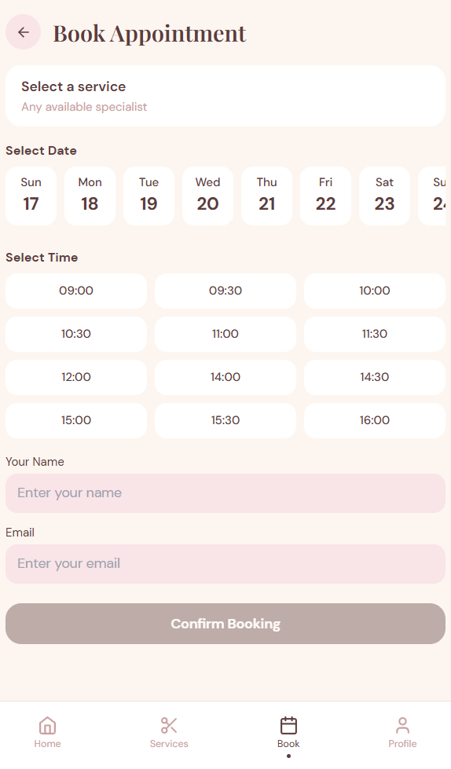

# FUTURE_UX_02 — Salon Appointment Booking Mobile App UI

## Project Overview

This project is a modern mobile application UI design for a salon appointment booking system. The app was designed to provide users with a seamless and user-friendly booking experience through clean mobile interfaces, intuitive navigation, and elegant visual design.

The design focuses on simplifying the appointment booking process while maintaining a modern and aesthetically pleasing user experience.

---

## Internship Task

### Task 2 — Mobile App UI for Appointment Booking

> Design a mobile app UI for an appointment booking system for a service-based business such as a salon, clinic, consultant service, or fitness trainer platform.

This task focuses on:
- Mobile UX design
- User flow creation
- Interaction design
- Real-world app UI structuring

---

## Problem Statement

Many appointment booking applications have complex user flows, cluttered interfaces, and poor mobile usability, which often lead to frustrating booking experiences.

Users commonly face:
- Complicated appointment scheduling
- Too many booking steps
- Confusing navigation
- Lack of service visibility
- Poor mobile responsiveness

This project solves these issues by creating a modern, mobile-first booking experience with simplified navigation and intuitive interaction design.

---

## Objectives

- Create a smooth appointment booking experience
- Design a modern mobile-first interface
- Improve usability and accessibility
- Reduce booking complexity
- Enhance user engagement through elegant UI design

---

## Design Style

- Elegant and modern interface
- Soft pastel color palette
- Rounded cards and buttons
- Clean typography and spacing
- Minimal and user-friendly layouts
- Mobile-responsive design

---

## Screens Designed

### 1. Splash Screen
- Brand introduction
- Clean onboarding experience

### 2. Login / Signup
- User authentication
- Simple and clean forms

### 3. Home Screen
- Service categories
- Search functionality
- Specialist recommendations

### 4. Service Selection
- Browse salon services
- Service cards with icons and images

### 5. Specialist Selection
- Top specialists section
- Ratings and reviews

### 6. Booking Calendar
- Date selection interface
- Calendar integration

### 7. Time Slot Selection
- Appointment scheduling flow
- Available time slots

### 8. Appointment Confirmation
- Booking summary
- Confirmation message

### 9. User Profile
- Appointment history
- User information
- Profile settings

---

## Features

- Bottom navigation bar
- Search functionality
- Appointment reminders
- Ratings and reviews
- Smooth navigation flow
- Mobile-first user experience
- Clean and modern UI components

---

## Design Process

### Research
- Analyzed salon and booking applications
- Studied modern mobile UI patterns
- Explored user-friendly appointment flows

### Wireframing
Created low-fidelity wireframes for:
- Booking flow
- Navigation structure
- User interactions

### Visual Design
Applied:
- Soft pastel color palette
- Rounded UI components
- Modern typography
- Consistent spacing system

### Responsive Design
Designed interfaces optimized for:
- Android devices
- iOS devices
- Various mobile screen sizes

---

## User Flow

```text
Splash Screen
   ↓
Login / Signup
   ↓
Home Screen
   ↓
Select Service
   ↓
Choose Specialist
   ↓
Select Date & Time
   ↓
Appointment Confirmation
```

---

## Tools Used

- Canva
- Miro
- Google Fonts
- Coolors
- GitHub

---

## Design Inspiration

Reference Website:
https://selfcare-salon.my.canva.site/

Inspired by:
- Modern salon booking apps
- Mobile-first UX patterns
- Minimal booking interfaces
- Elegant self-care brand aesthetics

---

## Screenshots

### Mobile UI Screens
()

### Booking Flow Screens
()

---

## Design Link

(selfcare-salon.my.canva.site)

---

## Key UX Decisions

- Reduced booking complexity using minimal steps
- Used rounded UI components for a friendly experience
- Added bottom navigation for easier mobile usability
- Designed large touch-friendly buttons
- Maintained clean visual hierarchy for better readability

---

## Learning Outcomes

Through this project, I learned:
- Mobile UI/UX design principles
- Appointment booking flow structuring
- User-centered mobile interactions
- Navigation and usability design
- Visual hierarchy and accessibility
- Real-world app interface design

---

## Author

### Ayesha Sabahath
UI/UX Design Intern — Future Interns

GitHub: (https://github.com/AyeshaSabahath)  
LinkedIn: (linkedin.com/in/ayesha-s-836673337)

---

## Acknowledgement

This project was completed as part of the UI/UX Design Internship Program by Future Interns.
